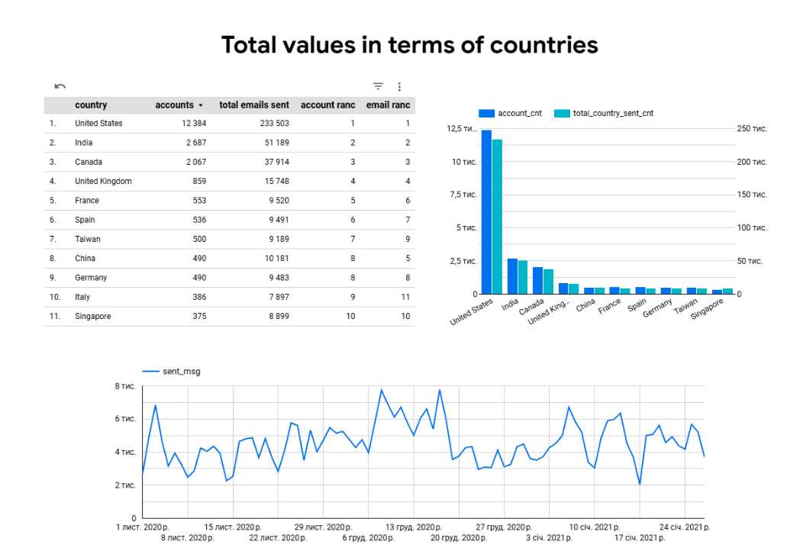

# 📊 E-commerce User & Email Analytics (SQL + Looker Studio)

## 🚀 Опис проєкту
Цей проєкт демонструє побудову аналітичного датасету для аналізу користувачів та email-активності в e-commerce продукті.

Основна мета — об’єднати дані про акаунти та email-взаємодію в єдину модель для подальшого аналізу, сегментації та візуалізації.

---

## 📎 SQL код
Повний SQL-запит знаходиться у файлі:
👉 [Переглянути SQL запит](./sql/ecommerce_analysis.sql)

## 📂 Джерело даних

Дані зберігаються у середовищі Google BigQuery та не є публічно доступними.

Проєкт виконаний на основі навчального датасету e-commerce платформи, який включає наступні таблиці:
- `account` — інформація про користувачів  
- `account_session` — зв’язок акаунтів із сесіями  
- `session` — дані про сесії користувачів  
- `session_params` — параметри сесій (включаючи країну)  
- `email_sent` — відправлені email-повідомлення  
- `email_open` — відкриття email  
- `email_visit` — переходи за email-посиланнями

 ⚠️ Доступ до вихідних таблиць не надається, оскільки вони є частиною навчального середовища BigQuery.

## 🎯 Завдання
- Аналіз створення акаунтів  
- Аналіз email-активності:
  - відправлення  
  - відкриття  
  - переходи  
- Сегментація користувачів за:
  - країною  
  - інтервалом відправки  
  - статусом верифікації  
  - статусом підписки  

---

## 🛠 Технології
- BigQuery (SQL)  
- Looker Studio  
- CTE  
- JOIN, UNION  
- Window Functions (RANK, SUM OVER)  

---

## 🧠 Основна логіка
- Розрахунок метрик акаунтів та email окремо  
- Об’єднання даних через `UNION ALL`  
- Агрегація в єдиний датасет  
- Побудова метрик на рівні країни  
- Ранжування країн за ключовими показниками  

---

## 📊 Метрики

### Основні:
- `account_cnt` — кількість акаунтів  
- `sent_msg` — кількість відправлених листів  
- `open_msg` — кількість відкриттів  
- `visit_msg` — кількість переходів  

### Додаткові:
- `total_country_account_cnt` — загальна кількість акаунтів по країні  
- `total_country_sent_cnt` — загальна кількість відправлених листів по країні  
- `rank_total_country_account_cnt` — рейтинг країн за кількістю акаунтів  
- `rank_total_country_sent_cnt` — рейтинг країн за кількістю відправлених листів  

---

## 📈 Візуалізація
Dashboard створено в Looker Studio.

### Реалізовано:
- Порівняння країн за:
  - кількістю акаунтів  
  - email-активністю  
  - рейтингом  
- Аналіз динаміки відправки email по датах  

---

## 📸 Dashboard Preview

---

## 💡 Висновки
- Визначено топ-країни за активністю користувачів  
- Виявлено ключові ринки для розвитку  
- Проаналізовано ефективність email-кампаній  
- Дані можуть бути використані для оптимізації маркетингових стратегій  

---
